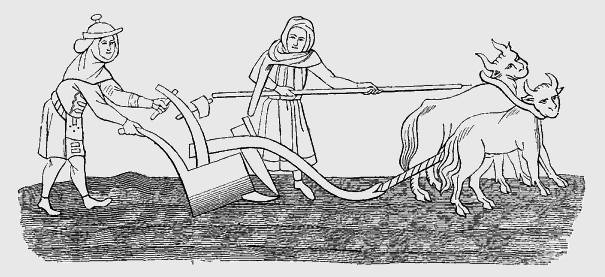

furlong
=========

A Typescript library for computing pairwise distance metrics in the browser or with node.




## Installation

`npm install furlong --save`

## Usage

furlong can be used with Node or with plain Javascript; it has no external dependencies. To use with Node, simply require it:  
```const pairwiseDistance = require('furlong').pairwiseDistance```

To use in Javascript, just import it:  
```import { pairwiseDistance } from 'furlong'```

Distance functions can be called directly using the value method, which return a scaler value:

``` 
>>> pairwiseDistance('euclidean').distance([0,0,0],[0,0,100])
100
```

Accessor functions can be used for more complex data structures:
```
>>> const distanceFunc = pairwiseDistance('chebyshev')
                     .x(d => d.foo)
                     .y(d => d.bar})

>>> const vectorA = [{'foo': 12},{'foo': 7},{'foo': 0}]
>>> const vectorB = [{'bar': 6},{'bar': 32},{'bar': 27}]
>>> distanceFunc.distance(vectorA, vectorB)
27
```

furlong provides several built-in distances functions and also supports user defined functions. The provided distance functions include:

* Euclidean distance
* Manhattan distance
* Chebyshev distance
* Bray Curtis distance
* Canberra distance 
* Hamming distance

Custom distance functions can be used with furlongs accessors as well:

```
>>> const customDistanceFunc = (v1, v2) => 0
>>> pairwiseDistance('hamming')
    .func(customDistanceFunc)
    .distance([0,0],[1,1])
0
```

## Testing

* Using npm:  
  `npm test`

## Release History

* 0.1.0 Initial release
* 0.2.0 Ported library to Typescript
